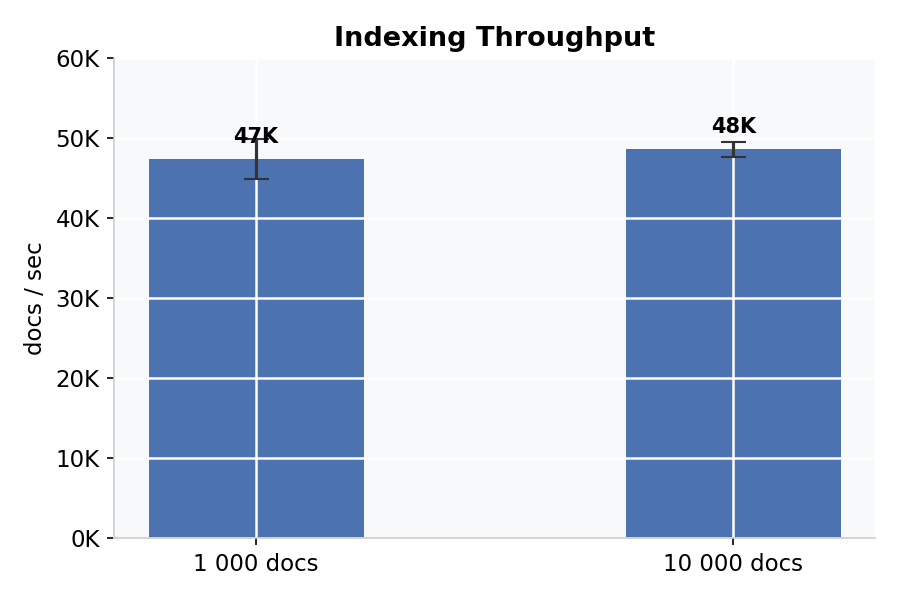
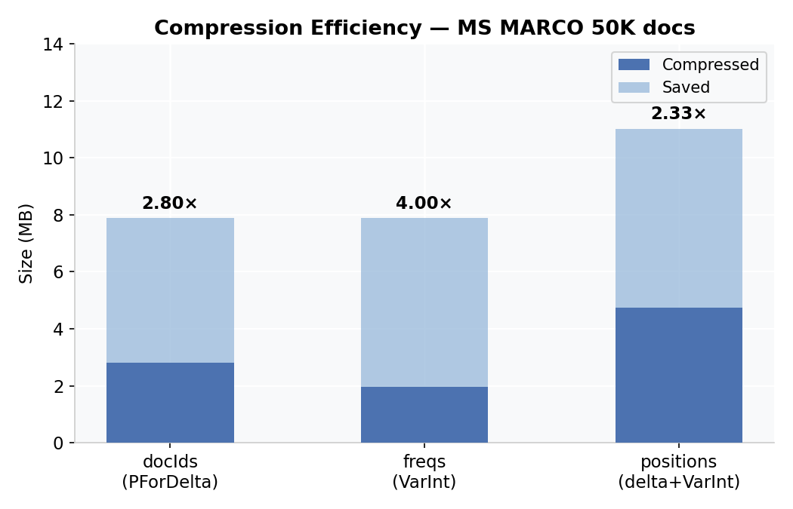

# InvertedMind

Библиотека инвертированного индекса на Java 17 с координатными постинг-листами, PForDelta-сжатием, skip list-ами и BM25-ранжированием.

## Возможности

- **Координатный инвертированный индекс** — для каждого терма: docId, TF, позиции вхождений
- **PForDelta-сжатие** — блоки по 128 значений, 90-й персентиль определяет ширину бит, исключения хранятся отдельно
- **Delta-encoding** — docId и позиции кодируются как разности (gaps), что уменьшает размер значений
- **Mmap-хранение** — сегменты `MappedByteBuffer` (Java NIO), декодирование только по запросу
- **Skip list** — интервал `sqrt(df)`, O(√n) для `advance(targetDocId)` без промежуточных коллекций
- **Поисковые операторы** — AND, OR, NOT, ADJ (фраза), NEAR/N (proximity)
- **BM25-ранжирование** — Okapi BM25, k1=1.2, b=0.75
- **ANTLR4-парсер** — скобки, кавычки, приоритеты операторов

## Архитектура

### Модули

```
InvertedMind/
├── invertedmind-core/     Основная библиотека
├── invertedmind-bench/    JMH бенчмарки + MS MARCO загрузчик
└── invertedmind-demo/     CLI-демо
```

### Пакеты (invertedmind-core)

```
com.vanmors.invertedmind
├── core/       Posting, PostingList, TermDictionary, InvertedIndex, IndexConfig
├── codec/      PForDeltaCodec, DeltaTransform, VarIntUtil
├── storage/    SegmentHeader, SegmentWriter, MmapSegmentReader, Segment
├── query/      Query AST (sealed), ANTLR4-парсер, PostingListIterator, And/Or/Not/Adj/Near
├── index/      StandardTokenizer, Analyzer, StopWordFilter, IndexBuilder
├── scoring/    BM25Scorer
└── util/       VarIntUtil, BitUtil
```

### Пайплайн индексации

```
Текст документа
    │
    ▼
StandardTokenizer  ─── split по Unicode, lowercase
    │
    ▼
Analyzer (+ StopWordFilter)
    │
    ▼
IndexBuilder  ─── группирует токены по терму, считает TF и позиции
    │
    ▼
PostingList.build()  ─── delta-encode → PForDelta → skip list
    │
    ▼
SegmentWriter ─── [Header 96B][TermDictionary][PostingLists][DocNorms]
```

### Пайплайн поиска

```
Строка запроса
    │
    ▼
ANTLR4 Parser → QueryAstBuilder → Query AST (sealed interface)
    │
    ▼
QueryPlanner → дерево PostingListIterator
    │   ├── AndIterator    (дети отсортированы по cost)
    │   ├── OrIterator     (min-heap по docId)
    │   ├── NotIterator    (positive - negative)
    │   ├── AdjIterator    (AND + consecutive positions)
    │   └── NearIterator   (AND + |pos_i − pos_j| ≤ N)
    │
    ▼
ScoringQueryRunner → BM25 score → top-K (min-heap)
```

### Формат сегмента (.inv)

```
┌──────────────────────────┐  offset 0
│  Header (96 bytes)       │  magic, version, codec, counts, section offsets
├──────────────────────────┤
│  Term Dictionary         │  VInt(termLen) + UTF-8 + VInt(df) + VLong(ttf)
├──────────────────────────┤
│  Posting Lists           │  skip-метаданные + PForDelta(docIds) + VByte(freqs) + VByte(positions)
├──────────────────────────┤
│  Document Norms          │  VInt(docLength) × N
└──────────────────────────┘
```

### Синтаксис запросов

| Запрос | Описание |
|--------|----------|
| `fox` | Поиск по одному терму |
| `fox AND dog` | Оба терма присутствуют |
| `fox OR dog` | Любой из термов |
| `fox AND NOT cat` | fox есть, cat — нет |
| `"quick brown fox"` | Фраза — термы подряд (ADJ) |
| `fox NEAR/N dog` | Термы на расстоянии ≤ N позиций друг от друга в тексте |
| `(fox OR cat) AND dog` | Группировка |

**NEAR/N** — proximity-оператор: `fox NEAR/3 dog` выберет только документы, где между `fox` и `dog` не более 3 слов. Например, для текста `"the fox quickly chased the dog"` расстояние = 4 (не подходит), а для `"a fox met a dog"` = 3 (подходит). Реализован через `NearIterator`: после AND-слияния проверяет позиции обоих термов.

### BM25

```
score(D, t) = IDF(t) × tf × (k1 + 1) / (tf + k1 × (1 − b + b × |D| / avgdl))
IDF(t)      = ln(1 + (N − df + 0.5) / (df + 0.5))
k1 = 1.2,  b = 0.75
```

---

## Бенчмарки

> Окружение: JDK 17.0.13, OpenJDK 64-bit, Apple M-series, JMH 1.37  
> Метод: 3 прогрева + 5 измерений (2 с каждое), 1 форк  
> Полные сырые результаты: [`docs/benchmark-results.txt`](docs/benchmark-results.txt)

### Скорость индексации

Корпус: реальные пассажи MS MARCO. JMH, 3 прогрева + 5 измерений.

| Корпус | Пропускная способность | ± погрешность | Время на документ |
|--------|----------------------|-------------|-----------------|
| 1 000 документов | 47 400 docs/sec | 2 500 | 21 мкс/doc |
| 10 000 документов | 48 600 docs/sec | 900 | 21 мкс/doc |



### Эффективность сжатия (MS MARCO 50K документов)

| Компонент | Метод | Raw | Сжато | Коэффициент |
|-----------|-------|-----|-------|-------------|
| docIds | delta + PForDelta (блоки 128) | 7.88 MB | 2.81 MB | **2.80×** |
| freqs | VarInt | 7.88 MB | 1.97 MB | **4.00×** |
| positions | delta + VarInt | 11.02 MB | 4.73 MB | **2.33×** |
| **Итого** | | **26.79 MB** | **10.76 MB** | **2.49×** |

Freqs сжимаются лучше всего (4×): большинство частот равно 1, VarInt кодирует их в 1 байт вместо 4.  
На df < 10 PForDelta даёт накладные расходы: заголовок блока 128 значений доминирует над реальными данными.



### Латентность запросов (JMH, MS MARCO 50 000 документов)

Все бинарные операторы используют **одну и ту же пару реальных термов** из MS MARCO-индекса (выбираются автоматически по критерию df ∈ [100, 2000]). `Dev query` — реальный запрос из MS MARCO dev-сета, конвертированный в OR.

| Тип запроса | Среднее (мкс) | ± погрешность | QPS |
|-------------|--------------|---------------|-----|
| Phrase (ADJ) | 22.4 | ±0.8 | ~44 600 |
| AND | 23.2 | ±1.4 | ~43 100 |
| Single-term | 27.8 | ±3.3 | ~36 000 |
| NEAR/5 | 29.2 | ±2.3 | ~34 200 |
| AND NOT | 34.9 | ±2.2 | ~28 700 |
| Complex | 108.3 | ±7.7 | ~9 200 |
| OR | 161.3 | ±3.5 | ~6 200 |
| Dev query (OR, 4–8 слов) | 15 889 | ±4 947 | ~63 |


**Phrase и AND быстрее Single-term** — оба оператора используют постинговый список меньшего терма как драйвер (`terms[1]`, df=346), пропрыгивая большой список (`terms[0]`, df=966) через skip list. Объём скорированных документов ≪ 346. Single-term вынужден скорить все 966 документов.

**AND NOT медленнее AND** на реальных данных — `NotIterator` проходит по всем 966 документам из `terms[0]` и лишь исключает 346 из них; результирующее множество (~900 docs) больше, чем у AND (~50–100 docs). Это обратная картина по сравнению с синтетическими Zipfian-данными, где оба терма были очень частотными.

**Dev query** (реальные пользовательские запросы MS MARCO) — OR по 4–8 термам; каждый термин даёт тысячи результатов, min-heap OrIterator тратит большую часть времени на слияние.

### Флеймграфы (async-profiler, CPU)

Сгенерированы через `ProfileBenchmark` + async-profiler на 50K MS MARCO документах.

**addDocument** — добавление одного пассажа в IndexBuilder с уже 50 000 документами:
- [`docs/charts/flamegraph_add_document.html`](docs/charts/flamegraph_add_document.html) — открыть в браузере
- Горячие пути: `StandardTokenizer.analyze` → `String.toLowerCase` → `TreeMap.computeIfAbsent` → `ArrayList.add`

**searchAnd** — AND-запрос к 50K-документному индексу (~23 µs/op):
- [`docs/charts/flamegraph_search_and.html`](docs/charts/flamegraph_search_and.html) — открыть в браузере
- Горячие пути: `QueryParser` → `AndIterator.next` → `TermPostingIterator.advance` (PForDelta decode, skip list) → `BM25Scorer.score`

Перегенерировать:
```bash
LIB=/opt/homebrew/lib/libasyncProfiler.dylib
java -Dmsmarco.dir=data/msmarco \
     -jar invertedmind-bench/target/benchmarks.jar "ProfileBenchmark.addDocument" \
     -jvmArgs "-Dmsmarco.dir=data/msmarco -agentpath:${LIB}=start,event=cpu,flamegraph,file=docs/charts/flamegraph_add_document.html" \
     -wi 3 -i 5 -f 1
```

### Загрузка сегмента (MemoryBenchmark)

| Размер корпуса | Время загрузки | ± погрешность |
|----------------|---------------|---------------|
| 10 000 пассажей MS MARCO | **2.72 мс** | ±0.59 мс |

Загрузка включает только открытие mmap-буферов и чтение term dictionary. Постинг-листы декодируются лениво при первом обращении.

---

### MS MARCO End-to-End (100 000 пассажей)

**Датасет:** MS MARCO Passages, первые 100K из ~8.8M, [microsoft.github.io/msmarco](https://microsoft.github.io/msmarco/)

#### Характеристики корпуса

| Параметр | Значение |
|----------|---------|
| Документов | 100 000 |
| Токенов всего | 5 527 885 |
| Уникальных термов | 110 917 |
| Средняя длина документа | 55.3 токена |

#### Производительность индексации

| Этап | Время | Пропускная способность |
|------|-------|------------------------|
| Загрузка TSV с диска | 123 мс | ~813 000 docs/sec (I/O) |
| Токенизация + добавление в индекс | 2 123 мс | ~47 100 docs/sec |
| Сжатие (PForDelta) | 666 мс | — |
| Запись сегмента на диск | 996 мс | — |
| **Итого (индексация без I/O)** | **2 789 мс** | **~35 850 docs/sec** |

#### Сегмент на диске

| Параметр | Значение |
|----------|---------|
| Размер файла | 22 459 923 байт (21.4 МБ) |
| Коэффициент сжатия к raw int32¹ | 1.0× |

¹ raw int32 оценка = `totalTokens × 4` — учитывает только позиции. Сегмент также хранит docId, TF, skip-структуры и term dictionary, поэтому итоговый объём сопоставим. Сжатие docId-ов само по себе эффективнее.

#### Примеры запросов к 100K пассажам

| Запрос | Тип | Совпадений | Латентность (мкс) |
|--------|-----|-----------|------------------|
| `dog` | Single-term | 501 | 141 |
| `dog AND cat` | AND | 28 | 141 |
| `science AND NOT fiction` | AND NOT | 530 | 153 |
| `water NEAR/3 temperature` | NEAR/3 | 62 | 407 |
| `(cancer OR tumor) AND treatment` | Complex | 182 | 360 |
| `machine OR learning` | OR | 803 | 357 |
| `president OR government` | OR | 2 191 | 742 |
| `"new york"` | Phrase | 1 028 | 756 |


Single-term и AND — самые быстрые (141 µs): маленький постинг-лист у `cat` ограничивает AND-итератор. OR по частотным термам (`president OR government`, 2191 хит) медленнее всего — нужно слить два больших постинг-листа через min-heap.

#### Статистика по 1 000 MS MARCO dev-запросов

Реальные пользовательские запросы (2–8 слов) преобразованы в OR-запросы.

| Метрика | Значение |
|---------|---------|
| Выполнено запросов | 1 000 (ошибок: 0) |
| Средняя латентность | 32.7 мс |
| Пропускная способность | 31 QPS |
| Суммарных совпадений | 57 907 387 |

Высокая латентность объясняется OR по нескольким частотным термам — постинг-листы большие, skip list не помогает при полном сканировании.

---

## Сборка и запуск

```bash
# Сборка + тесты (89 тестов)
mvn clean test

# Демо
mvn compile -pl invertedmind-demo -am
mvn exec:java -pl invertedmind-demo \
    -Dexec.mainClass=com.vanmors.invertedmind.demo.DemoApp

# Собрать uber-jar бенчмарков
mvn clean package -pl invertedmind-bench -am -DskipTests

# Запустить все JMH бенчмарки
java -jar invertedmind-bench/target/benchmarks.jar

# Только запросы
java -jar invertedmind-bench/target/benchmarks.jar QueryBenchmark

# MS MARCO end-to-end (скачивает ~3 ГБ при первом запуске)
java -cp invertedmind-bench/target/benchmarks.jar \
     com.vanmors.invertedmind.bench.MsMarcoBenchmark data/msmarco 100000
```

## Тесты

```bash
mvn test
```

| Тест | Что проверяет |
|------|--------------|
| `VarIntUtilTest` | VByte encode/decode roundtrip |
| `BitUtilTest` | bit packing/unpacking |
| `DeltaTransformTest` | delta encoding/decoding |
| `CodecRoundtripTest` | PForDelta roundtrip для разных распределений |
| `SegmentRoundtripTest` | запись и чтение сегмента через mmap |
| `QueryParserTest` | парсинг всех типов запросов |
| `EndToEndQueryTest` | полный цикл: индексация → запрос → BM25 scores |

## Ссылки

- Zobel & Moffat, [*Inverted Files for Text Search Engines*](https://doi.org/10.1145/1132956.1132959), ACM Computing Surveys, 2006
- Robertson & Zaragoza, [*The Probabilistic Relevance Framework: BM25 and Beyond*](https://doi.org/10.1561/1500000019), Foundations and Trends in IR, 2009
- Yan et al., [*Inverted Index Compression Using Word-Aligned Binary Codes*](https://doi.org/10.1016/j.is.2012.08.002), Information Systems, 2013 — PForDelta
- Büttcher et al., *Information Retrieval: Implementing and Evaluating Search Engines*, MIT Press, 2010
- MS MARCO dataset: [microsoft.github.io/msmarco](https://microsoft.github.io/msmarco/)
