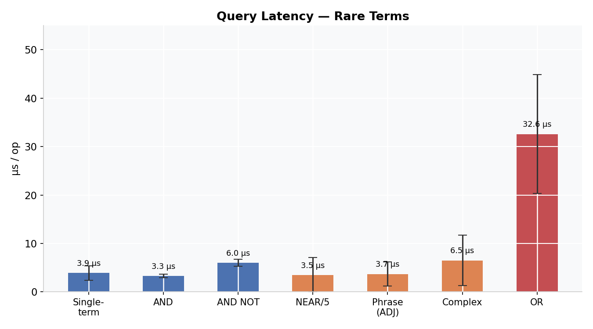
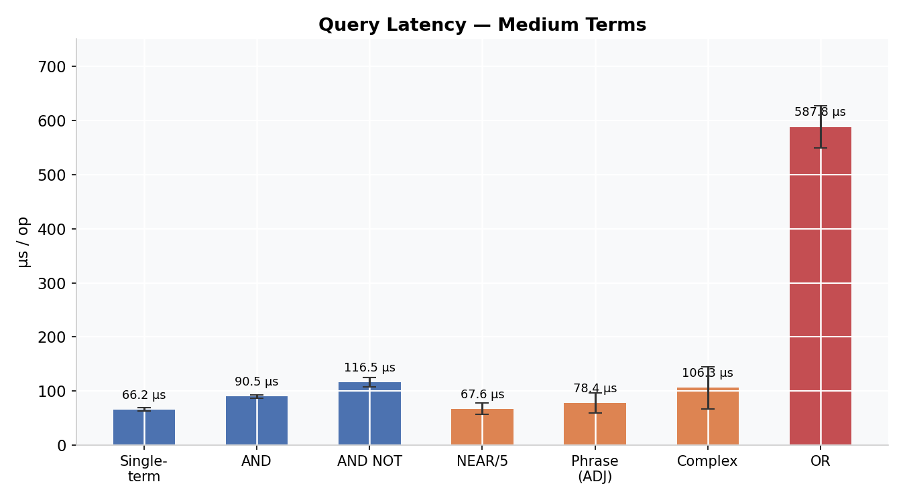
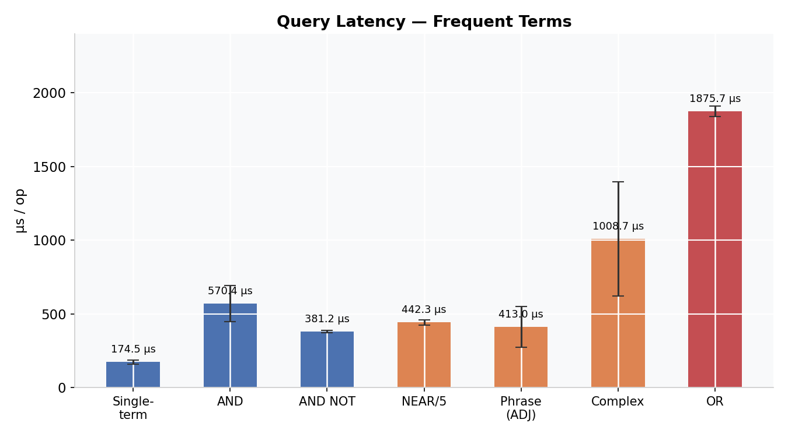
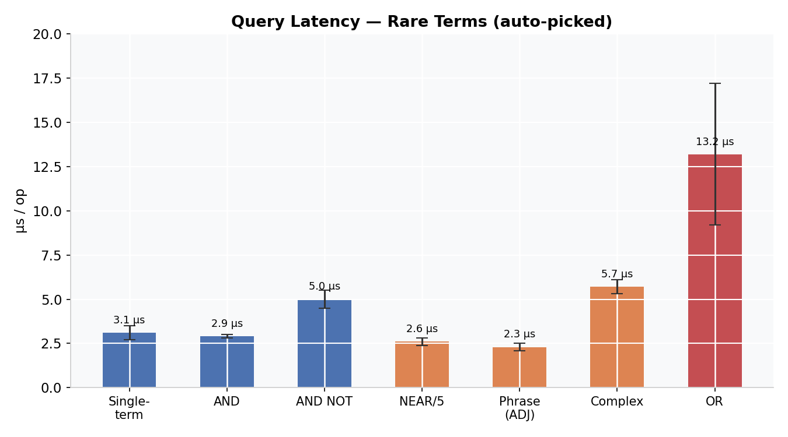
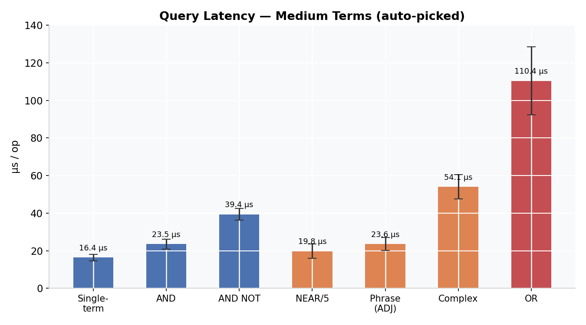
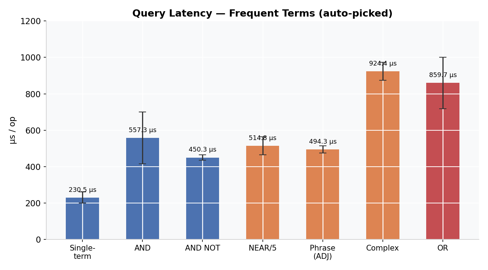
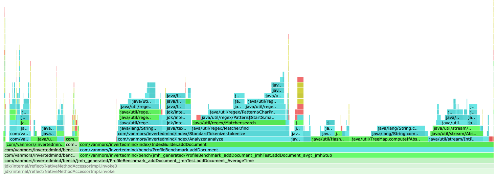
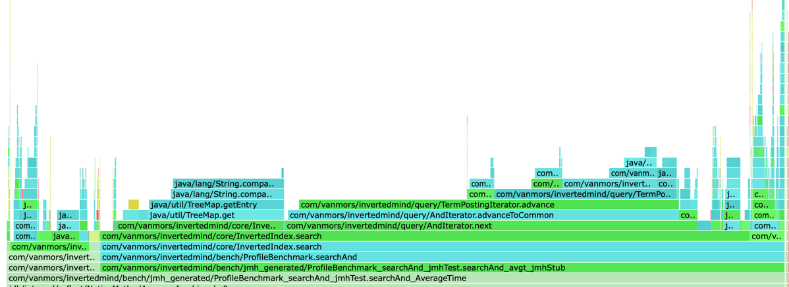
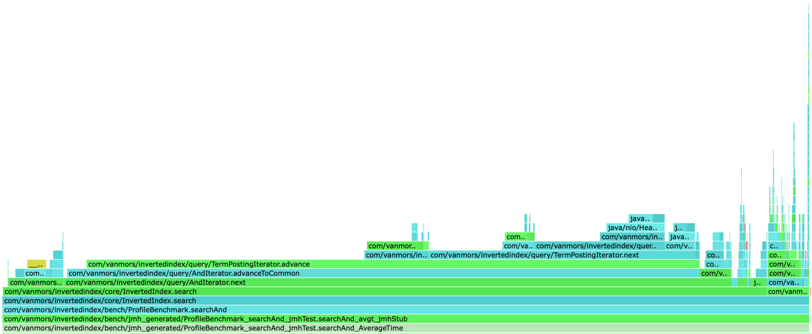

# InvertedIndex

Библиотека инвертированного индекса на Java 17 с координатными постинг-листами, PForDelta-сжатием, skip list-ами и
BM25-ранжированием.

## Архитектура

### Модули

```
InvertedIndex/
├── invertedindex-core/     Основная библиотека
└── invertedindex-demo/     CLI-демо
```

### Синтаксис запросов

| Запрос                 | Описание                                               |
|------------------------|--------------------------------------------------------|
| `fox`                  | Поиск по одному терму                                  |
| `fox AND dog`          | Оба терма присутствуют                                 |
| `fox OR dog`           | Любой из термов                                        |
| `fox AND NOT cat`      | fox есть, cat - нет                                    |
| `"quick brown fox"`    | Фраза - термы подряд (ADJ)                             |
| `fox NEAR/N dog`       | Термы на расстоянии ≤ N позиций друг от друга в тексте |
| `(fox OR cat) AND dog` | Группировка                                            |

### BM25

```
score(D, t) = IDF(t) x tf x (k1 + 1) / (tf + k1 x (1 − b + b x |D| / avgdl))
IDF(t)      = ln(1 + (N − df + 0.5) / (df + 0.5))
k1 = 1.2,  b = 0.75
```

---

## Бенчмарки

### Эффективность сжатия

| Компонент | Метод          | Raw      | Сжато    | Коэффициент |
|-----------|----------------|----------|----------|-------------|
| docIds    | PForDelta      | 7.88 MB  | 2.81 MB  | 2.80x       |
| freqs     | VarInt         | 7.88 MB  | 1.97 MB  | 4.00x       |
| positions | delta + VarInt | 11.02 MB | 4.73 MB  | 2.33x       |
| Итого     |                | 26.79 MB | 10.76 MB | 2.49x       |


### Латентность запросов

Три группы термов - редкие, средние и частые.

| Группа          | Тип запроса | Запрос                                        | Среднее (мкс) | ± погрешность |
|-----------------|-------------|-----------------------------------------------|---------------|---------------|
| Редкие          | Single-term | `volcano`                                     | 3.9           | ±1.5          |
| (df < 100)      | AND         | `volcano AND castle`                          | 3.3           | ±0.4          |
|                 | AND NOT     | `volcano AND NOT castle`                      | 6.0           | ±0.7          |
|                 | NEAR/5      | `volcano NEAR/5 castle`                       | 3.5           | ±3.6          |
|                 | Phrase      | `"volcano castle"`                            | 3.7           | ±2.5          |
|                 | Complex     | `(volcano OR castle) AND amber AND NOT ivory` | 6.5           | ±5.2          |
|                 | OR          | `volcano OR castle`                           | 32.6          | ±12.3         |
| Средние         | Single-term | `blood`                                       | 66.2          | ±3.3          |
| (df 500–2500)   | AND         | `blood AND pain`                              | 90.5          | ±3.2          |
|                 | AND NOT     | `blood AND NOT pain`                          | 116.5         | ±8.3          |
|                 | NEAR/5      | `blood NEAR/5 pain`                           | 67.6          | ±10.2         |
|                 | Phrase      | `"blood pain"`                                | 78.4          | ±18.7         |
|                 | Complex     | `(blood OR pain) AND cancer AND NOT drug`     | 106.3         | ±38.8         |
|                 | OR          | `blood OR pain`                               | 587.8         | ±38.6         |
| Частые          | Single-term | `time`                                        | 174.5         | ±13.8         |
| (df 5000–10000) | AND         | `time AND first`                              | 570.4         | ±122.4        |
|                 | AND NOT     | `time AND NOT first`                          | 381.2         | ±8.0          |
|                 | NEAR/5      | `time NEAR/5 first`                           | 442.3         | ±16.4         |
|                 | Phrase      | `"time first"`                                | 413.0         | ±137.2        |
|                 | Complex     | `(time OR first) AND many AND NOT other`      | 1008.7        | ±386.8        |
|                 | OR          | `time OR first`                               | 1875.7        | ±35.3         |





Редкие термы (3-33 us) - все операторы кроме OR работают за 3–7 us: постинг-листы короткие, пересечение почти мгновенно.
OR медленнее из-за накладных расходов min-heap даже на 160 документах.

Средние термы (66-588 us) - NEAR и Phrase быстрее AND: проверка позиций отсеивает кандидатов раньше. OR на порядок
медленнее остальных - скорирует ~3800 уникальных документов.

Частотные термы (174-1876 us) - латентность растёт пропорционально df. OR на двух термах с df 7000 обрабатывает 12 000
документов -> 1.9 мс. AND NOT быстрее AND: `NotIterator` отсеивает 6500 из 6937 документов `time`, оставляя 400; AND же
должен искать пересечение двух больших списков.

### Латентность запросов - авто-выбор термов

Замер на том же корпусе MS MARCO 100K, но термы теперь выбираются автоматически в `QueryBenchmark.setup` из
`postingLists` по диапазонам df (`[50,100]`, `[500,2500]`, `[5000,10000]`). Фильтр: только латиница, длина ≥ 4 символов.

| Группа  | Тип запроса | Среднее (мкс)        | ± погрешность |
|---------|-------------|----------------------|---------------|
| Редкие  | Single-term | 3.1                  | ±0.4          |
|         | AND         | 2.9                  | ±0.1          |
|         | AND NOT     | 5.0                  | ±0.5          |
|         | NEAR/5      | 2.6                  | ±0.2          |
|         | Phrase      | 2.3                  | ±0.2          |
|         | Complex     | 5.7                  | ±0.4          |
|         | OR          | 13.2                 | ±4.0          |
| Средние | Single-term | 16.4                 | ±1.7          |
|         | AND         | 23.5                 | ±2.6          |
|         | AND NOT     | 39.4                 | ±3.1          |
|         | NEAR/5      | 19.8                 | ±3.7          |
|         | Phrase      | 23.6                 | ±3.4          |
|         | Complex     | 54.1                 | ±6.5          |
|         | OR          | 110.4                | ±18.1         |
| Частые  | Single-term | 230.5                | ±31.0         |
|         | AND         | 557.3                | ±142.2        |
|         | AND NOT     | 450.3                | ±14.6         |
|         | NEAR/5      | 514.8                | ±49.2         |
|         | Phrase      | 494.3                | ±20.1         |
|         | Complex     | 924.4                | ±49.6         |
|         | OR          | 859.7                | ±140.7        |





Общая картина повторяет старую: операторы `AND`/`NEAR`/`Phrase` остаются сопоставимыми по стоимости, `OR` выделяется. По
сравнению с захардкоженным набором.

### Флеймграфы (CPU)

addDocument - добавление одного документа в IndexBuilder с уже 50 000 документами:


searchAnd - AND-запрос к 50K-документному индексу (23 us/op):



